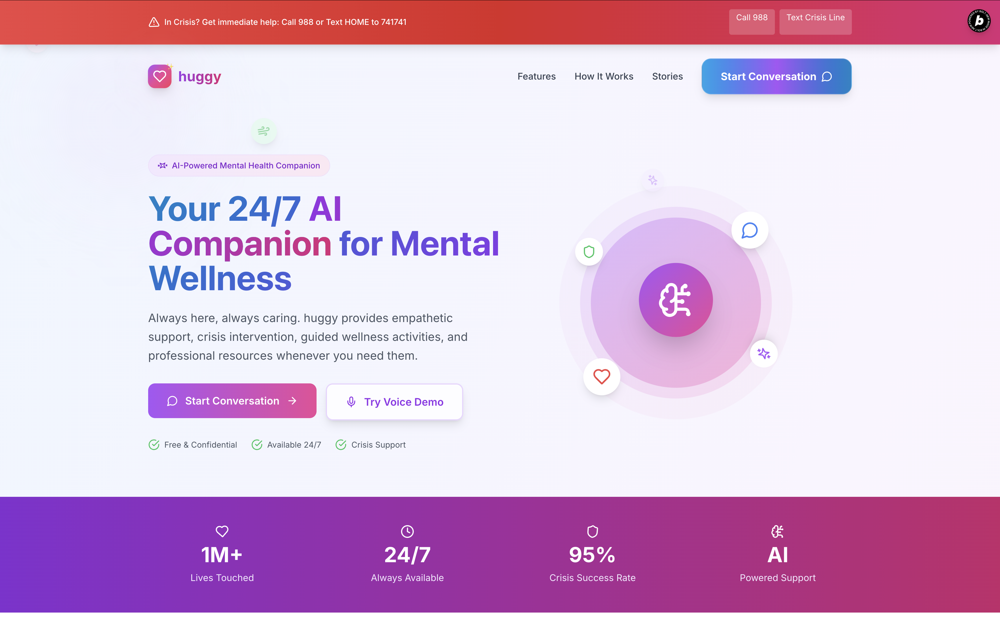
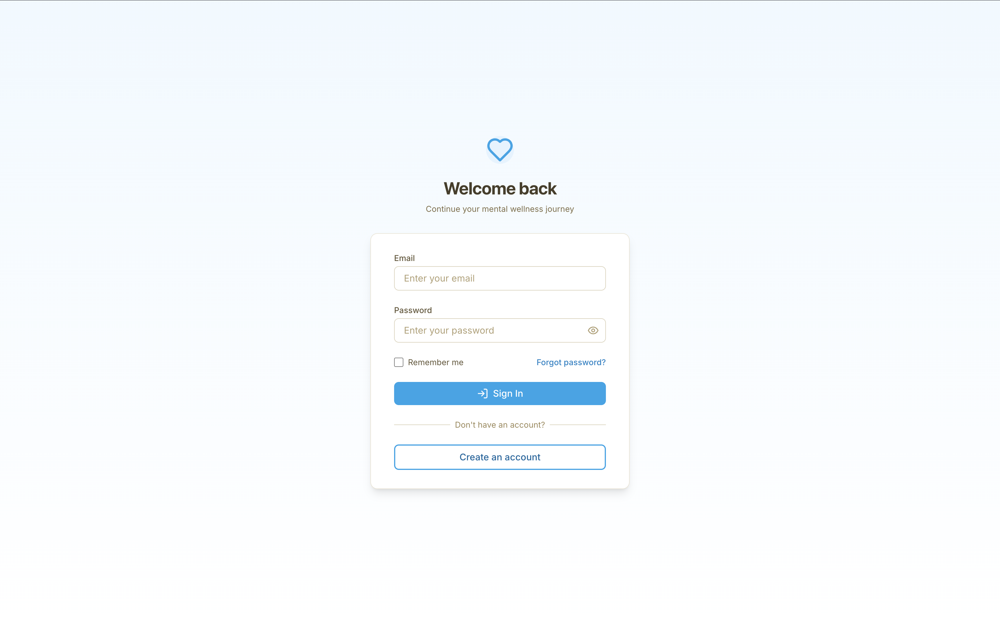
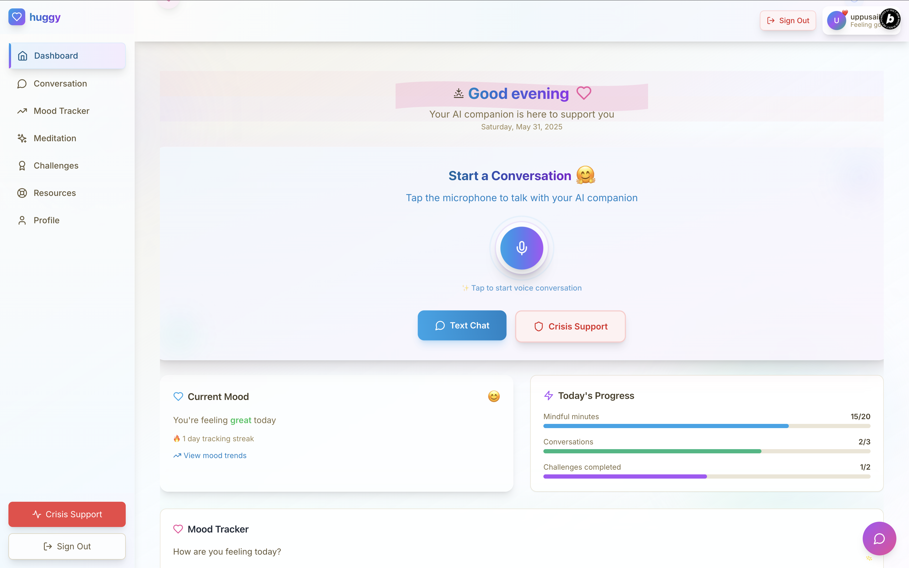
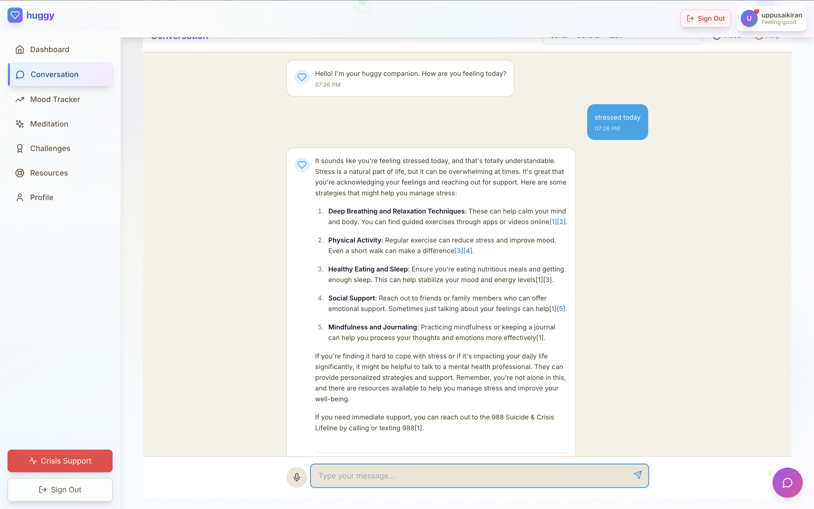
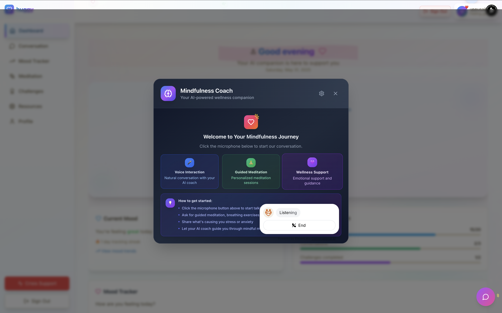
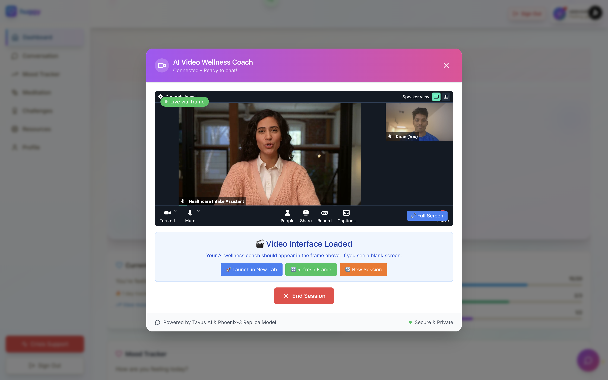
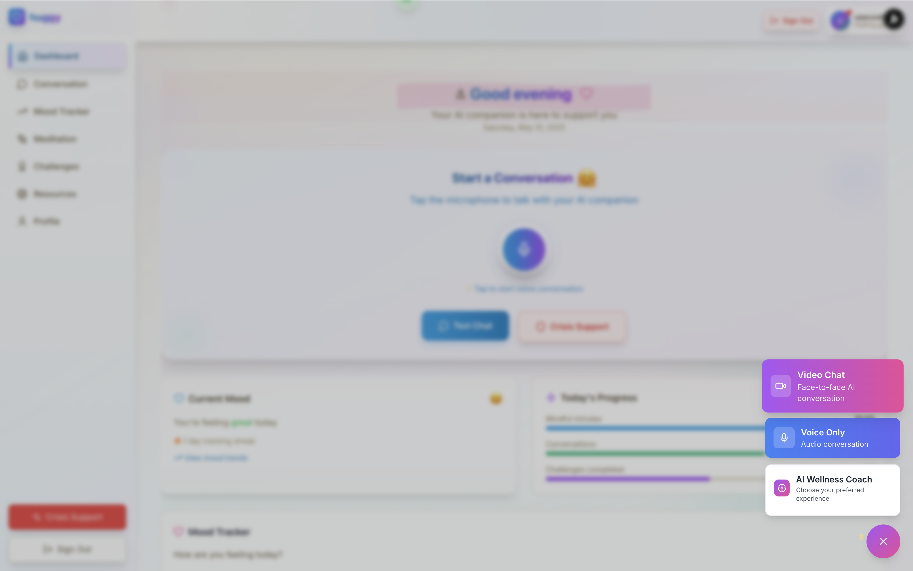
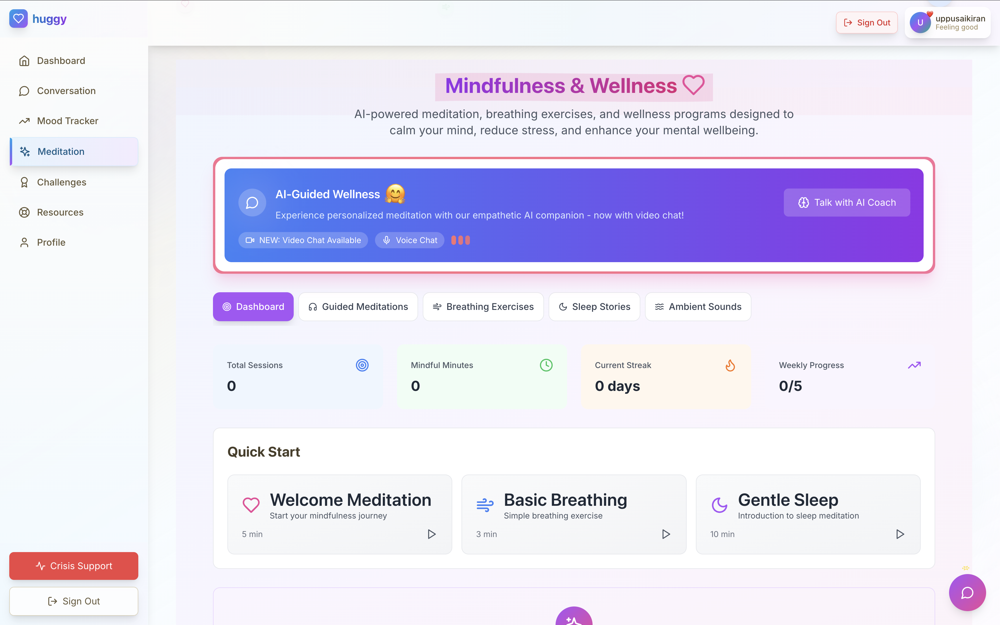
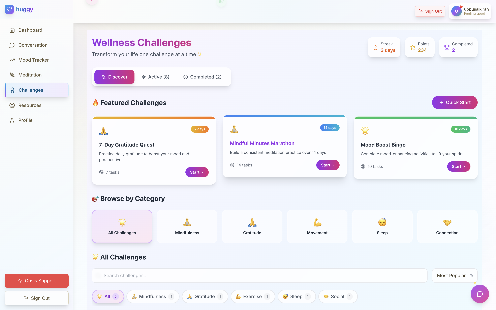
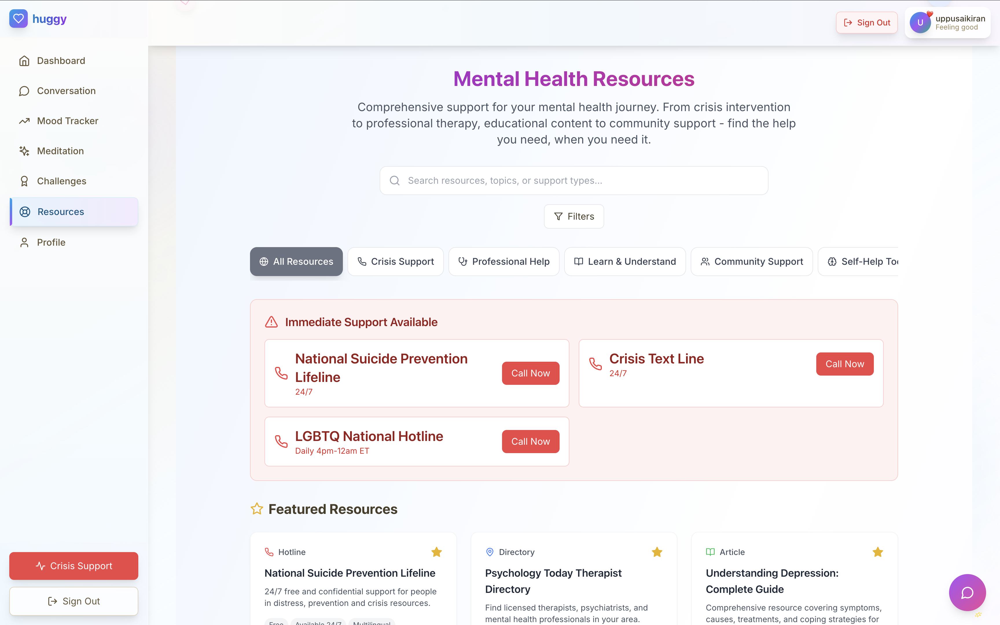

# huggy - AI Mental Health Companion

<div align="center">
  
  
  <h3>Your 24/7 AI Mental Health Companion - Always Here, Always Caring</h3>
  
  [](https://opensource.org/licenses/MIT)
  [](https://reactjs.org/)
  [](https://www.typescriptlang.org/)
  [](https://tailwindcss.com/)
</div>

---

## 🌟 Overview

huggy is a revolutionary AI-powered mental health companion that provides 24/7 empathetic support, crisis intervention, and personalized wellness guidance. Built with cutting-edge AI technology, huggy offers a safe space for users to explore their mental wellbeing through natural conversations and guided activities.

### 🎯 Mission
To democratize mental health support and make it accessible to everyone, everywhere, at any time. We aim to bridge the gap in mental healthcare by providing immediate, empathetic, and intelligent support through conversational AI.

---

## 🚀 Key Features

### 🤖 AI Companion Chat
- **Voice & Text Conversations**: Natural interactions with empathetic AI
- **Emotional Intelligence**: AI understands and responds to emotional context
- **24/7 Availability**: Always ready to listen and provide support
- **Personalized Responses**: Adapts to your communication style and needs

### 🎥 Video Conversations
- **Face-to-Face Support**: Interactive video sessions with AI wellness coach
- **Real-time Engagement**: Natural conversation flow with visual feedback
- **Personalized Experience**: AI adapts to your visual cues and expressions

### 🆘 Crisis Support
- **Immediate Intervention**: Real-time crisis detection and response
- **Emergency Resources**: Quick access to crisis hotlines and professional help
- **Safety Planning**: Collaborative safety plan development
- **Follow-up Care**: Continuous support after crisis episodes

### 🧘 Wellness Programs
- **Guided Meditation**: Voice-guided mindfulness sessions
- **Breathing Exercises**: Interactive breathing techniques with visual guidance
- **Mindfulness Activities**: Daily practices for mental wellbeing
- **Sleep Support**: Calming bedtime stories and sleep hygiene tips

### 📊 Mood Tracking
- **Daily Check-ins**: Monitor emotional wellbeing patterns
- **Progress Insights**: Visual analytics of your mental health journey
- **Trend Analysis**: Identify patterns and triggers
- **Goal Setting**: Set and track personal wellness objectives

### 🎮 Gamified Challenges
- **Wellness Quests**: Engaging self-care activities
- **Progress Rewards**: Achievement system for motivation
- **Community Challenges**: Connect with others on similar journeys
- **Streak Tracking**: Build healthy habits through consistency

### 🌐 Community Support
- **Peer Connections**: Engage with others in a supportive environment
- **Shared Experiences**: Anonymous sharing of progress and insights
- **Group Activities**: Participate in community wellness challenges
- **Success Stories**: Inspirational journeys from other users

### 👨‍⚕️ Professional Resources
- **Therapist Directory**: Find licensed mental health professionals
- **Telehealth Integration**: Connect with online therapy services
- **Resource Library**: Comprehensive mental health information
- **Appointment Scheduling**: Seamless booking with healthcare providers

---

## 📱 Application Screenshots & Features

### 🏠 Homepage - Welcome Experience


The welcoming homepage introduces users to huggy's capabilities with a clean, calming design. Features include:
- **Warm Welcome Message**: Inviting introduction to mental health support
- **Feature Overview**: Clear explanation of available services
- **Easy Navigation**: Simple access to sign up or sign in
- **Accessibility**: Designed for users in various emotional states

---

### 🔐 Authentication - Secure Sign In


Secure and user-friendly authentication system:
- **Clean Interface**: Minimalist design reduces cognitive load
- **Social Login Options**: Quick access through popular platforms
- **Privacy Assurance**: Clear data protection commitments
- **Accessibility Features**: Screen reader compatible and keyboard navigation

---

### 📋 Dashboard - Your Mental Health Hub


The comprehensive dashboard provides an overview of your mental health journey:
- **Mood Timeline**: Visual representation of emotional patterns
- **Quick Actions**: Easy access to chat, meditation, and resources
- **Progress Overview**: Weekly and monthly wellness insights
- **Personalized Recommendations**: AI-suggested activities based on your needs
- **Crisis Support Button**: Always-visible emergency support access

---

### 💬 AI Conversation - Text Chat Support


The heart of huggy - intelligent, empathetic conversation:
- **Natural Language Processing**: AI understands context and emotions
- **Therapeutic Techniques**: Incorporates CBT, DBT, and mindfulness approaches
- **Real-time Responses**: Immediate support when you need it most
- **Conversation Memory**: AI remembers your preferences and progress
- **Crisis Detection**: Automatic identification of distress signals
- **Resource Suggestions**: Contextual recommendations for additional help

---

### 🎤 Voice Conversations - Natural Audio Interaction


Experience natural, spoken conversations with your AI companion:
- **ElevenLabs Integration**: High-quality, natural voice synthesis
- **Emotion Recognition**: AI detects emotional state through voice patterns
- **Hands-free Support**: Perfect for when you need support while on the go
- **Voice Customization**: Choose from different AI voice personalities
- **Noise Cancellation**: Clear communication in any environment

---

### 🎥 Video Wellness Coach - Face-to-Face Support


Revolutionary video interaction with AI wellness coach:
- **Tavus AI Integration**: Realistic video conversations with AI
- **Visual Emotional Analysis**: AI reads facial expressions and body language
- **Interactive Sessions**: Guided exercises and real-time feedback
- **Personalized Coaching**: Tailored wellness plans based on visual cues
- **Privacy Protected**: Secure video processing with data protection

---

### 👩‍⚕️ AI Wellness Coach - Personalized Guidance


Meet your personal AI wellness coach:
- **Expert Knowledge**: Trained on evidence-based therapeutic practices
- **Personalized Plans**: Custom wellness strategies for your unique needs
- **Progress Tracking**: Monitor your journey with detailed analytics
- **Goal Setting**: Collaborative objective setting and achievement tracking
- **Adaptive Learning**: AI improves recommendations based on your responses

---

### 🧘 Meditation & Mindfulness - Guided Practices


Comprehensive mindfulness and meditation features:
- **Guided Sessions**: Voice-led meditation with various techniques
- **Breathing Exercises**: Interactive visual guides for deep breathing
- **Progressive Muscle Relaxation**: Step-by-step tension release
- **Mindfulness Reminders**: Personalized notifications for mindful moments
- **Session Library**: Extensive collection of meditation practices
- **Custom Sessions**: Personalized meditation based on your needs

---

### 🎮 Wellness Challenges - Gamified Self-Care


Engaging wellness challenges to build healthy habits:
- **7-Day Gratitude Quest**: Daily gratitude practice with community sharing
- **Mindful Minutes Marathon**: Meditation streak tracking and rewards
- **Mood Boost Bingo**: Complete mood-enhancing activities
- **Social Connection Challenge**: Encourage healthy relationships
- **Sleep Hygiene Heroes**: Improve sleep habits through gamification
- **Progress Tracking**: Visual progress indicators and achievement badges
- **Community Features**: Share achievements and support others

---

### 📚 Mental Health Resources - Comprehensive Support


Extensive library of mental health resources and support:
- **Crisis Hotlines**: Immediate access to emergency mental health support
- **Therapist Directory**: Find licensed professionals in your area
- **Educational Content**: Evidence-based mental health information
- **Support Groups**: Connect with local and online communities
- **Self-Help Tools**: Interactive worksheets and assessment tools
- **Emergency Contacts**: Quick access to emergency services
- **Telehealth Options**: Connect with online therapy platforms

---

## 🛠️ Technical Architecture

### **Frontend Stack**
- **React 18.2.0**: Modern React with hooks and context
- **TypeScript**: Type-safe development for better code quality
- **Tailwind CSS**: Utility-first CSS framework for rapid UI development
- **Framer Motion**: Smooth animations and micro-interactions
- **React Router**: Client-side routing for seamless navigation
- **Vite**: Fast build tool and development server

### **AI & Voice Technologies**
- **Perplexity API**: Advanced natural language processing
- **ElevenLabs**: High-quality voice synthesis and recognition
- **Tavus AI**: Realistic video conversation capabilities
- **OpenAI**: Supplementary AI processing for complex tasks

### **Backend & Database**
- **Supabase**: PostgreSQL database with real-time capabilities
- **Authentication**: Secure user management and session handling
- **Row Level Security**: Database-level privacy protection
- **Real-time Subscriptions**: Live data updates across clients

### **State Management**
- **React Context**: Global state management for user data
- **Zustand**: Lightweight state management for UI components
- **React Hook Form**: Efficient form state management
- **Custom Hooks**: Reusable stateful logic across components

### **Mobile Support**
- **React Native**: Cross-platform mobile application support
- **NativeWind**: Tailwind CSS for React Native styling
- **Native Voice**: Platform-specific voice recognition capabilities
- **Gesture Handler**: Smooth mobile interactions and gestures

---

## 🚀 Quick Start Guide

### Prerequisites
- Node.js 18+ and npm
- Git for version control
- Code editor (VS Code recommended)

### 1. Clone the Repository
```bash
git clone https://github.com/yourusername/mind-haven.git
cd mind-haven
```

### 2. Install Dependencies
```bash
npm install
```

### 3. Environment Configuration
Create a `.env` file in the project root:

```env
# Core AI APIs
VITE_PERPLEXITY_API_KEY=your_perplexity_api_key
VITE_ELEVENLABS_API_KEY=your_elevenlabs_api_key
VITE_TAVUS_API_KEY=your_tavus_api_key
VITE_OPENAI_API_KEY=your_openai_api_key

# Supabase Configuration
VITE_SUPABASE_URL=your_supabase_project_url
VITE_SUPABASE_ANON_KEY=your_supabase_anon_key

# Optional: Analytics and Monitoring
VITE_ANALYTICS_ID=your_analytics_id
```

### 4. Database Setup
```bash
# Initialize Supabase (if using locally)
npx supabase init
npx supabase start
npx supabase db reset
```

### 5. Start Development Server
```bash
npm run dev
```

### 6. Build for Production
```bash
npm run build
npm run preview
```

### 7. Mobile Development (Optional)
```bash
# iOS
npm run ios

# Android
npm run android
```

---

## 📊 Project Structure

```
mind-haven/
├── public/                 # Static assets and screenshots
├── src/
│   ├── components/         # React components
│   │   ├── auth/          # Authentication components
│   │   ├── challenges/    # Wellness challenge components
│   │   ├── conversation/  # Chat and voice components
│   │   ├── layout/        # Layout and navigation
│   │   ├── mood/          # Mood tracking components
│   │   ├── ui/            # Reusable UI components
│   │   └── voice/         # Voice interaction components
│   ├── context/           # React context providers
│   ├── hooks/             # Custom React hooks
│   ├── lib/               # Utility libraries and configs
│   ├── pages/             # Page components
│   ├── services/          # API services and integrations
│   └── utils/             # Helper functions
├── supabase/              # Database migrations and types
├── docs/                  # Comprehensive documentation
├── ios/                   # iOS-specific files
└── Configuration files    # Vite, TypeScript, Tailwind, etc.
```

---

## 🔧 API Integration Details

### Perplexity AI Integration
- **Natural Language Understanding**: Processes user messages for intent and emotion
- **Contextual Responses**: Generates appropriate therapeutic responses
- **Crisis Detection**: Identifies potential mental health emergencies
- **Conversation Memory**: Maintains context across multiple interactions

### ElevenLabs Voice Features
- **Text-to-Speech**: Converts AI responses to natural-sounding speech
- **Voice Cloning**: Personalized AI voice based on user preferences
- **Emotion Synthesis**: Matches voice tone to conversation context
- **Real-time Processing**: Low-latency voice generation for natural conversation

### Tavus Video AI
- **Realistic Avatars**: Video representation of AI wellness coach
- **Lip Synchronization**: Accurate mouth movements with speech
- **Emotional Expressions**: Facial expressions matching conversation tone
- **Interactive Sessions**: Real-time video conversation capabilities

### Supabase Backend
- **Authentication**: Secure user registration and login
- **Database**: User data, conversation history, and progress tracking
- **Real-time**: Live updates for chat and progress sharing
- **Security**: Row-level security and data encryption

---

## 🔒 Privacy & Security

### Data Protection
- **End-to-End Encryption**: All conversations encrypted in transit and at rest
- **HIPAA Compliance**: Healthcare data protection standards
- **User Control**: Complete data ownership and deletion rights
- **Anonymous Analytics**: Aggregate insights without personal identification
- **Secure Storage**: Cloud-based security with regular audits

### Privacy Features
- **Opt-in Data Sharing**: Users control what data is shared
- **Anonymous Mode**: Use the app without creating an account
- **Data Export**: Download your complete data at any time
- **Right to Deletion**: Complete data removal upon request
- **Transparency**: Clear privacy policy and data usage explanations

---

## 🌍 Accessibility & Inclusivity

### Universal Design
- **Screen Reader Support**: Full compatibility with assistive technologies
- **Keyboard Navigation**: Complete app functionality without a mouse
- **High Contrast Mode**: Enhanced visibility for users with vision impairments
- **Large Text Options**: Scalable font sizes for better readability
- **Voice Commands**: Navigate the app using voice input

### Multilingual Support
- **Language Options**: English, Spanish, French, German, Mandarin
- **Cultural Sensitivity**: Culturally appropriate responses and recommendations
- **Localized Resources**: Region-specific mental health resources and hotlines
- **Translation Quality**: Professional-grade translations for accuracy

### Inclusive Features
- **Diverse Representation**: Inclusive imagery and language throughout
- **LGBTQ+ Support**: Specialized resources and understanding
- **Neurodiversity**: Support for ADHD, autism, and other neurodivergent conditions
- **Trauma-Informed**: Approaches designed for trauma survivors
- **Crisis-Specific**: Specialized support for various crisis types

---

## 📚 Documentation

### User Guides
- [Getting Started Guide](docs/GETTING_STARTED.md)
- [Feature Overview](docs/FEATURES.md)
- [Privacy & Security](docs/PRIVACY.md)
- [Troubleshooting](docs/TROUBLESHOOTING.md)

### Technical Documentation
- [AI Integration Guide](docs/AI_INTEGRATION.md)
- [Voice Features](docs/ELEVENLABS_INTEGRATION.md)
- [Video Chat](docs/TAVUS_INTEGRATION.md)
- [Database Schema](docs/DATABASE.md)
- [API Documentation](docs/API.md)

### Development
- [Contributing Guide](docs/CONTRIBUTING.md)
- [Development Setup](docs/DEVELOPMENT.md)
- [Deployment Guide](docs/DEPLOYMENT.md)
- [Testing Guide](docs/TESTING.md)

---

## 🤝 Contributing

We welcome contributions from developers, mental health professionals, and advocates! Please see our [Contributing Guide](docs/CONTRIBUTING.md) for detailed information on:

- Code of conduct
- Development setup
- Pull request process
- Issue reporting
- Feature requests
- Documentation improvements

### Ways to Contribute
- **Code**: Bug fixes, new features, performance improvements
- **Documentation**: User guides, API docs, tutorials
- **Design**: UI/UX improvements, accessibility enhancements
- **Testing**: Bug reports, user testing, quality assurance
- **Content**: Mental health resources, educational materials
- **Translation**: Multilingual support and localization

---

## 🏆 Recognition & Awards

- **World's Largest Hackathon**: Finalist in Voice AI Challenge
- **Mental Health Innovation**: Recognition for accessible mental healthcare
- **Accessibility Excellence**: Award for inclusive design practices
- **Open Source Impact**: Community-driven mental health solution

---

## 📄 License

This project is licensed under the MIT License - see the [LICENSE](LICENSE) file for details.

### Third-Party Licenses
- React: MIT License
- Supabase: Apache 2.0 License
- Tailwind CSS: MIT License
- ElevenLabs: Commercial API License
- Tavus: Commercial API License

---

## 🙏 Acknowledgments

### Technology Partners
- **Bolt.new**: Primary development platform
- **ElevenLabs**: Voice AI technology
- **Tavus**: Video AI capabilities
- **Supabase**: Backend infrastructure
- **Netlify**: Deployment and hosting

### Mental Health Experts
- Clinical psychologists who provided therapeutic guidance
- Crisis intervention specialists for emergency protocols
- Accessibility experts for inclusive design
- Community advocates for user feedback

### Open Source Community
- Contributors who have improved the codebase
- Translators who have enabled multilingual support
- Beta testers who provided valuable feedback
- Documentation contributors

---

## 📞 Support & Contact

### For Users
- **Crisis Support**: If you're in immediate danger, call emergency services
- **Technical Support**: [support@huggy.ai](mailto:support@huggy.ai)
- **Feedback**: [feedback@huggy.ai](mailto:feedback@huggy.ai)
- **General Inquiries**: [hello@huggy.ai](mailto:hello@huggy.ai)

### For Developers
- **GitHub Issues**: Report bugs and request features
- **Discord Community**: Join our developer community
- **Documentation**: Comprehensive guides and API references
- **Contributing**: See our contributing guidelines

### Crisis Resources
- **National Suicide Prevention Lifeline**: 988
- **Crisis Text Line**: Text HOME to 741741
- **International**: See our [crisis resources page](docs/CRISIS_RESOURCES.md)

---

<div align="center">
  <p><strong>huggy - Always Here, Always Caring</strong></p>
  <p>Made with ❤️ for mental health and wellbeing</p>
  
  [](https://github.com/yourusername/mind-haven/stargazers)
  [](https://twitter.com/huggyai)
</div>