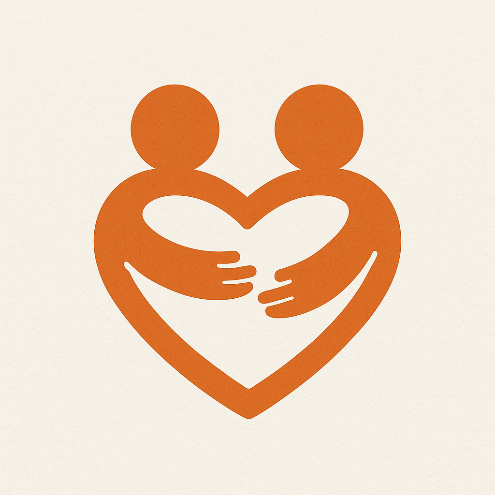

# HUG - AI Mental Health Companion



HUG is a revolutionary AI-powered mental health companion that provides 24/7 empathetic support, crisis intervention, and personalized wellness guidance. Built with cutting-edge AI technology, HUG offers a safe space for users to explore their mental wellbeing through natural conversations and guided activities.

## 🌟 Features

- **AI Companion Chat**: Voice and text conversations with an empathetic AI using Perplexity and ElevenLabs
- **Video Conversations**: Face-to-face interactions with AI wellness coach via Tavus integration
- **Crisis Support**: Immediate help and resource connections during difficult moments
- **Wellness Programs**: Guided meditation, breathing exercises, and mindfulness activities
- **Mood Tracking**: Monitor emotional wellbeing with insights and patterns
- **Community Support**: Engage with others on similar wellness journeys
- **Professional Resources**: Connect with therapists and mental health services

## 🚀 Quick Start

1. Clone the repository
2. Install dependencies:
   ```bash
   npm install
   ```
3. Set up environment variables:
   ```env
   # Core APIs
   VITE_PERPLEXITY_API_KEY=your_perplexity_key
   VITE_ELEVENLABS_API_KEY=your_elevenlabs_key
   VITE_TAVUS_API_KEY=your_tavus_key

   # Supabase Configuration
   VITE_SUPABASE_URL=your_supabase_url
   VITE_SUPABASE_ANON_KEY=your_supabase_key
   ```
4. Start the development server:
   ```bash
   npm run dev
   ```

## 🛠️ Tech Stack

- **Frontend**: React, TypeScript, Tailwind CSS
- **AI/ML**: Perplexity API, ElevenLabs, Tavus
- **Database**: Supabase
- **State Management**: React Context + Hooks
- **Animations**: Framer Motion
- **Styling**: Tailwind CSS + Custom Components

## 📚 Documentation

- [AI Integration Guide](docs/AI_INTEGRATION.md)
- [Voice Features](docs/VOICE_FEATURES.md)
- [Video Chat](docs/VIDEO_FEATURES.md)
- [Database Schema](docs/DATABASE.md)
- [Deployment Guide](docs/DEPLOYMENT.md)
- [Contributing Guide](docs/CONTRIBUTING.md)

## 🤝 Contributing

We welcome contributions! Please see our [Contributing Guide](docs/CONTRIBUTING.md) for details.

## 📄 License

MIT License - see [LICENSE](LICENSE) for details.

## 🙏 Acknowledgments

- Built with [Bolt.new](https://bolt.new)
- AI powered by Perplexity, ElevenLabs, and Tavus
- Database by Supabase
- Icons by Lucide React